# Ground Robot "Cali" (version 2021-22), Robotics Laboratory, California State University, Los Angeles
How to edit markdown files - https://www.markdownguide.org/cheat-sheet

# Table of Contents
 - [About](#about)
 - [Packages](#packages)
 - [Installation instructions](#installation-instructions)
 - [System at a glance](#system-at-a-glance)
 - [Simulation](#simulation)
   - [Autonomous Navigation](#autonomous-navigation)
   - [Manipulation Pipeline](#manipulation-pipeline)
   - [Perception Pipeline](#perception-pipeline)
   - [Fetch-and-Carry Mission](#fetch-and-carry-mission)
 - [Real Robot](#real-robot)
 - [Docker](#docker)


# About
<em>Cali</em> is an open-source robotic platform for research and education of mobile manipulators. The robot is made of off-the-shelf components and integrates many open-source software packages. This platform allows researchers and engineers to directly work on high-level tasks rather than to start everything from scratch to ease the development of mobile manipulators.  

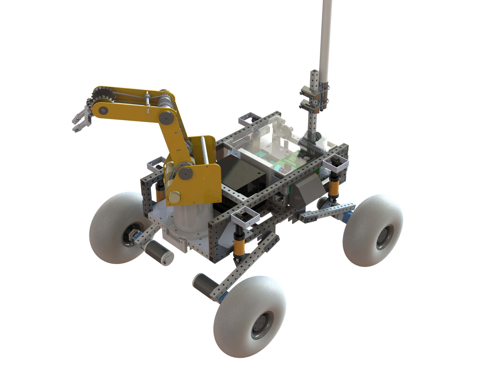


# Packages
## rover_autonav
Launch Autonomous Navigation

## manipulation
Contains manipulator URDF and configuration files for the arm

## cali_project_moveit_config
Contains Moveit configuration files

## perception
Contains Perception Pipeline

## arduino_codes
Contains the control codes

## docker_ros
Contains the docker images related to this project

# Installation instructions
The software is based on ROS-Melodic on a Ubuntu 18.04 laptop. 

Open up a terminal on your linux machine and execute following:
```bash
mkdir -p ~/catkin_ws/src
cd ~/catkin_ws/src
git clone https://github.com/jkoubs/project_cali.git 
cd ~/catkin_ws/
catkin_make
source devel/setup.bash
```


# System at a glance
- Hardware: Customed four-wheeled skid-steer drive base + Robotic arm (<em>Sorbot-ER III</em>)  
- Software: ROS Melodic, Ubuntu 18.04, Gazebo, Rviz, opencv ... 
- Computer: Jetson TX2
- Sensors: LiDAR, Camera, IMU, GPS, Wheel encoders, Battery-life sensor, LEDs

<em>Cali</em> is composed of a customed 4-wheeled skid steer drive mobile platform and a commercial manipulator system: <em>Sorbot-ER III</em>. The arm is composed of 5 revolute joints plus a gripper that can open and close.

A 2D LiDAR located near the arm base is used for navigation tasks. Additionally,
a depth camera used for object detection is placed near the end effector which will move
along its pitch orientation. The actuation system can be decomposed into two subsystems:
the first one controls the wheeled platform and the second one controls the robot arm. All
computations are handled with the Nvidia Jetson TX2 computer. The electronics
compartment allows electronics to cool under hot weather and provide a dust-free
environment for the components. The system contains a 12V 50Ah lithium battery to
power all the electronic components of the robot. The communication system allows far
range control of the robot up to 3.2km away from the base station.


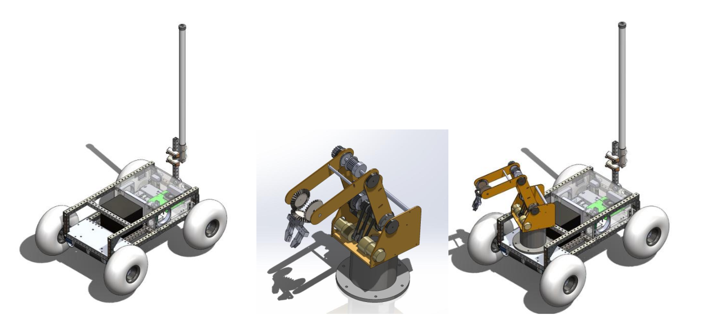

# Simulation
 

## Autonomous Navigation

  ### 1) Mapping
  The first step is to create a <strong>map</strong> using the <em><strong>slam_gmapping</strong></em> package.

  Open a <strong>new</strong> terminal and spawn the robot in Gazebo (<em>shell#1</em>):
  ```bash
roslaunch rover_autonav cali_ecst_lab.launch
```
  In a <strong>second</strong> terminal, launch the <em><strong>slam_gmapping</strong></em> node (<em>shell#2</em>):
  ```bash
roslaunch rover_autonav slam_gmapping.launch
```

  Now, we will move the robot around using <em>teleop</em> to create our map. In a <strong>third</strong> terminal (<em>shell#3</em>):
  ```bash
rosrun teleop_twist_keyboard teleop_twist_keyboard.py
```
  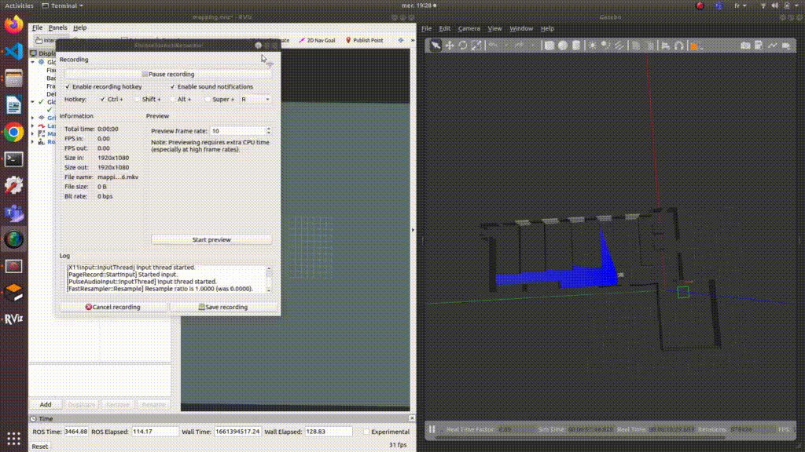

  Finally, we will save our new map and call it <em>ecst_lab_map</em>. In a <strong>fourth</strong> terminal (<em>shell#4</em>):
  ```bash
cd ~/catkin_ws/src/rover_autonav/maps
rosrun map_server map_saver -f ecst_lab_map
```
  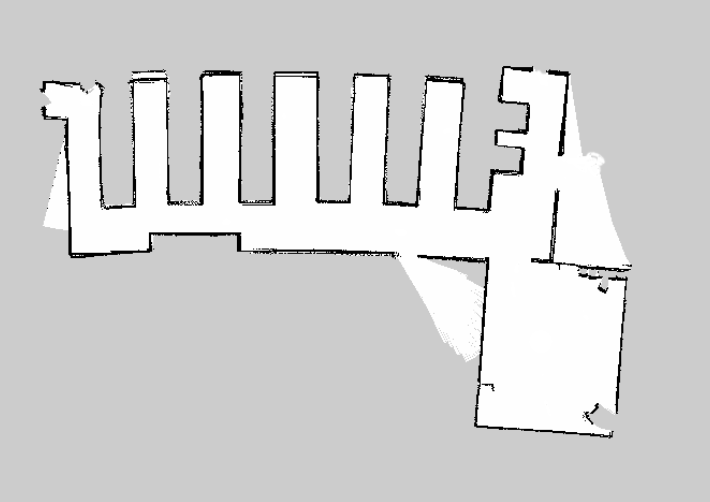

  ### 2) Localization
  Close all previous shells. Open a <strong>new</strong> terminal and spawn the robot in Gazebo (<em>shell#1</em>):

  ```bash
roslaunch rover_autonav cali_ecst_lab.launch
```
  In a <strong>second</strong> terminal, launch the <em><strong>localization</strong></em> node (<em>shell#2</em>):

  ```bash
roslaunch rover_autonav localization_ecst_lab.launch
```

  Once launched, need to set a <em><strong>2D Pose Estimate</strong></em> using Rviz. We can launch the teleoperation to move the robot around, we can see that this increases the localization estimate.
  ### 3) Launch Autonomous Navigation node

  Close all previous shells. Open a <strong>new</strong> terminal and spawn the robot in Gazebo (<em>shell#1</em>):

  ```bash
roslaunch rover_autonav cali_ecst_lab.launch
```
  In a <strong>second</strong> terminal, launch the <em><strong>Autonomous Navigation</strong></em> node (<em>shell#2</em>):

  ```bash
roslaunch rover_autonav navigation_teb.launch
```

  Then in RViz we just need to select a goal pose using the <em><strong>2D Nav Goal</strong></em> tool:

  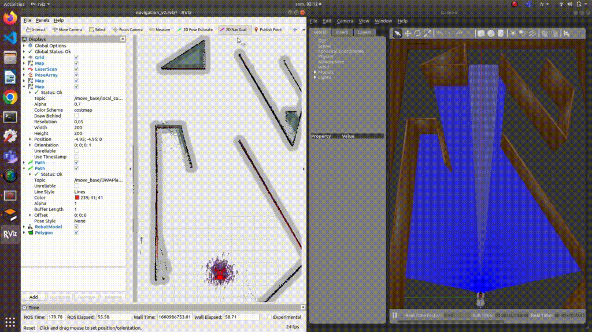
  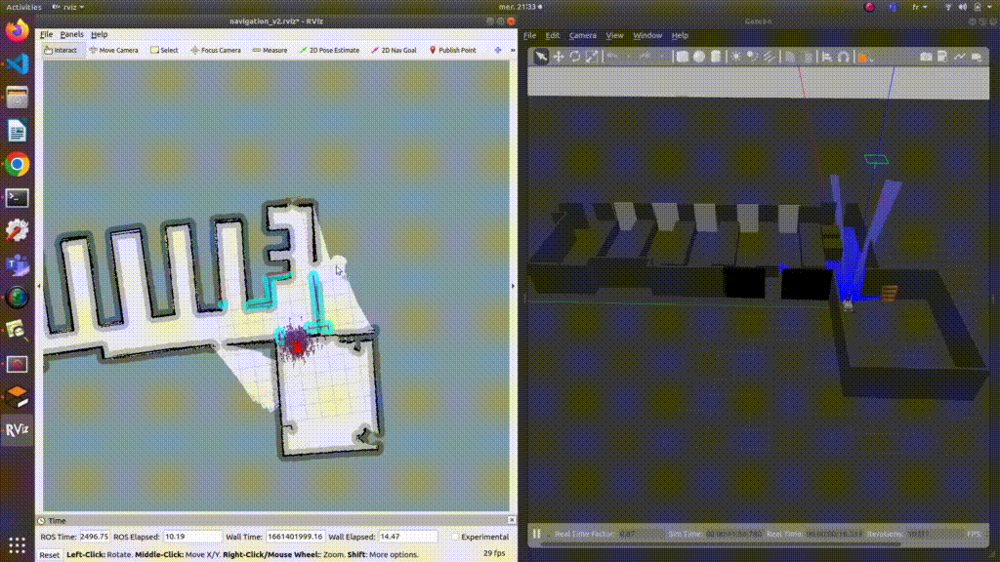

  ## Manipulation Pipeline
  First, we do some testings using <em><strong>rqt_joint_trajectory_controller</strong></em> to control the arm joints and also the <em><strong>/gripper_controller/gripper_cmd/goal</strong></em> topic to control the gripper.
  
  Then, we perform manipulation using <strong>MoveIt</strong>.

  ### 1) rqt_joint_trajectory_controller & <em>/gripper_controller/gripper_cmd/goal</em> topic
  - <em><strong>rqt_joint_trajectory_controller</strong></em>

  Close all previous shells and open a <strong>new</strong> terminal (<em>shell#1</em>):

  ```bash
  roslaunch manipulation arm_fixed_to_ground.launch 
  ```

  Then play with the <em><strong>rqt_joint_trajectory_controller</strong></em> GUI.
  
  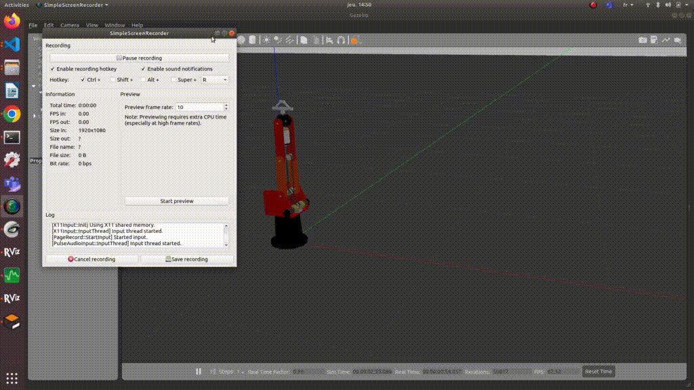

  -  <em><strong>/gripper_controller/gripper_cmd/goal</strong></em> topic

  Now, open a <strong>second</strong> terminal (<em>shell#2</em>):

  ```
 rostopic pub /gripper_controller/gripper_cmd/goal control_msgs/GripperCommandActionGoal "header:
  seq: 0
  stamp:
    secs: 0
    nsecs: 0
  frame_id: ''
goal_id:
  stamp:
    secs: 0
    nsecs: 0
  id: ''
goal:
  command:
    position: 2.0
    max_effort: 0.0" 
  ```
  Set a position of <em>2.0</em> to open the gripper and <em>0.0</em> to close it.
  
  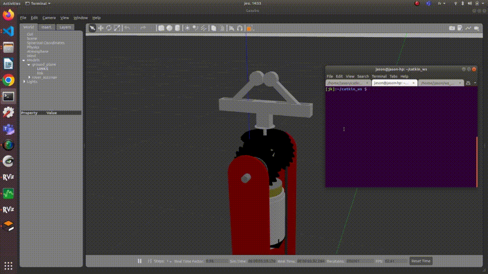

  ### 2) MoveIt

  Close all previous terminals, then open a <strong>new</strong> terminal (<em>shell#1</em>):
  ```bash
  roslaunch rover_autonav cali.launch
  ```
  In a <strong>second</strong> terminal (<em>shell#2</em>):
  ```bash
  roslaunch cali_project_moveit_config cali_planning_execution.launch
  ```

  - Arm

  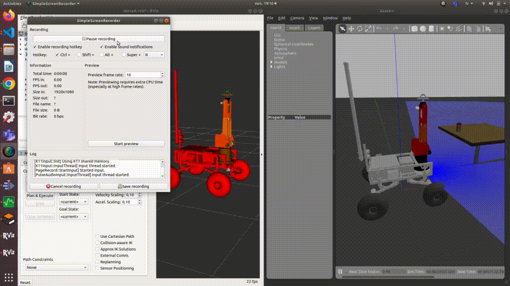

  - Gripper

  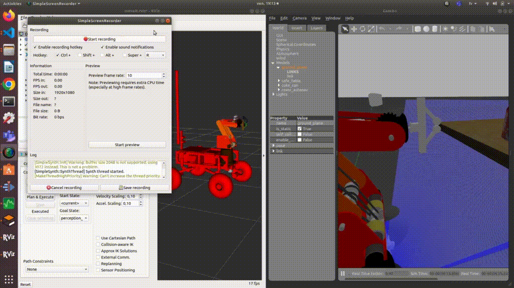

  - Grasp the coke can using joint commands

  In a <strong>third</strong> terminal (<em>shell#3</em>):
  ```bash
  rosrun manipulation pick_place_joint_cmds.py
  ```
  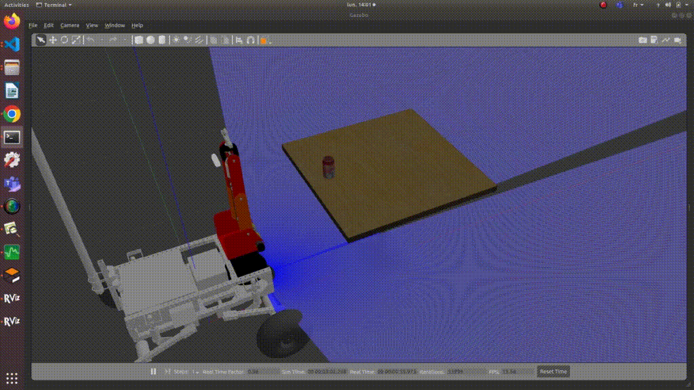

  Later, rather than using the joint commands, we will use the <strong>end effector position</strong> given by the <strong>Perception</strong> pipeline to grasp our object.


## Perception Pipeline

In order to perceive Cali's surroundings, an Intel Realsense d435 3D camera is used and placed on top of the last link of the arm. The data will then be used in ROS via a topic.

Before launching the perception pipeline the camera needs to be <strong>correctly aligned</strong>.
Thus, we have created a perception pose in Moveit for that matter.

Close all previous terminals, and open 3 new terminals (<em>shell#1, shell#2 and shell#3</em>):
  ```bash
roslaunch rover_autonav cali.launch
roslaunch cali_project_moveit_config cali_planning_execution.launch
roslaunch perception surface_detection.launch
```

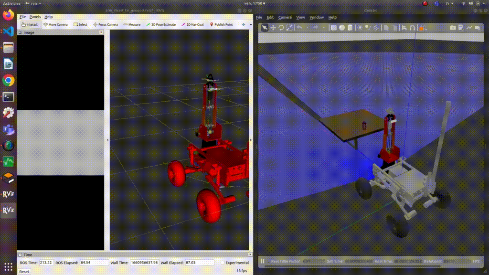

As we can see from the GIF, we first obtain the <strong>PointCloud</strong>:

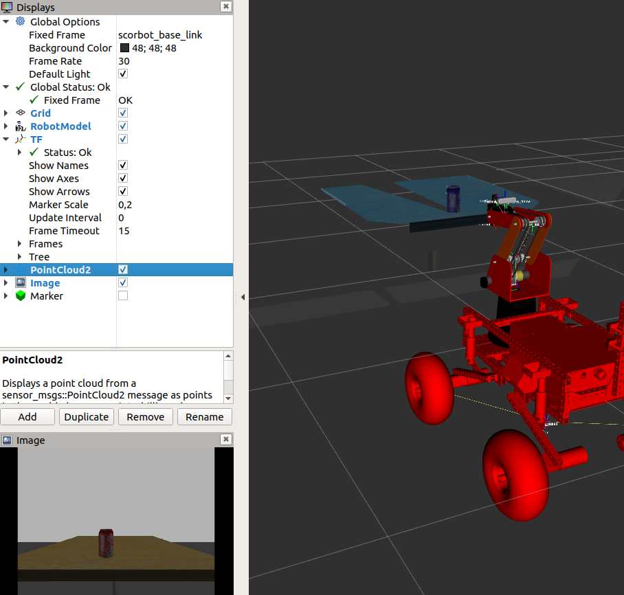


Then with our <strong>surface_detection</strong> algorithm we can detect a surface (purple marker) and an object (green marker) on top of that surface:

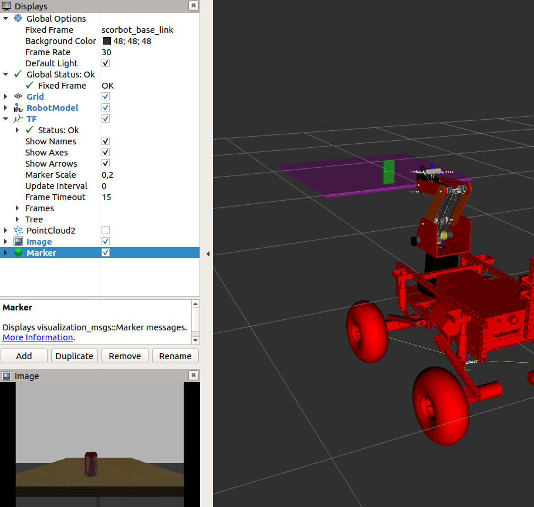

From the <strong>surface_detection</strong> we get the <em><strong>/surface_objects</strong></em> topic.

In a <strong>fourth</strong> terminal (<em>shell#4</em>):

```bash
rostopic echo /surface_objects
```

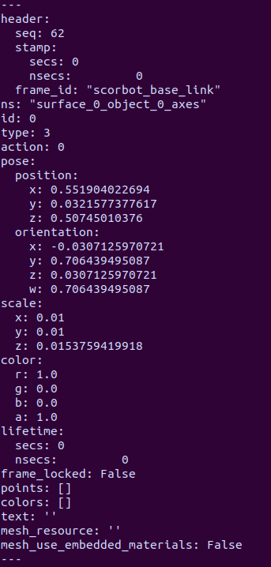

This gives information about the surfaces and objects detected such as the geometry, postion, orientation or even the color of the object.

We then use the position coordinates associated with the graspable object for MoveIt.

In a <strong>fifth</strong> and <strong>sixth</strong> terminal (<em>shell#5 and shell#6</em>):

```bash
rosrun perception pub_objects_position.py
rosrun manipulation pick_place_ee.py
```

Here is a GIF of the whole <strong>Perception/Manipulation</strong> pipeline:

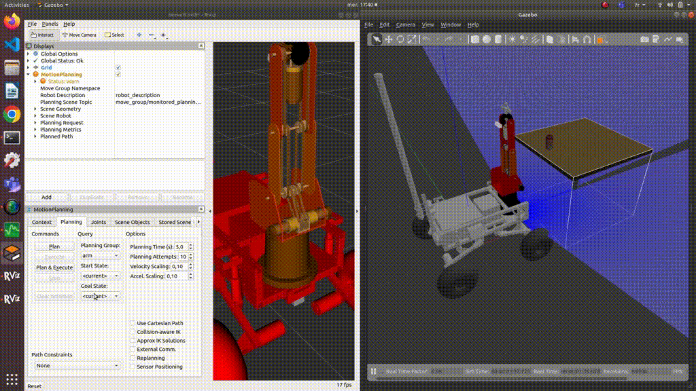


We can see that it is now able to grasp the object using our <strong>Perception/Manipulation</strong> pipeline.


## Fetch-and-Carry Mission
The goal of this mission is to perform a Fetch-and-Carry task in an indoor environment. It consists of picking a coke can from a room A and dump it into trash can located in room B.

Close all previous shells:

First, we source the workspace and then <strong>spawn</strong> the robot in Gazebo (<em>shell#1</em>):

```bash
cd ~/catkin_ws
source devel/setup.bash
roslaunch rover_autonav cali_ecst_lab.launch
```

Launch <strong>Moveit</strong> (<em>shell#2</em>):

```bash
roslaunch cali_project_moveit_config cali_planning_execution.launch
```

Calibrate camera in order to be correcly aligned to perform obejct detection (<em>shell#3</em>):

```bash
roslaunch manipulation camera_alignment.launch
```

Launch <strong>Navigation</strong> node (<em>shell#3</em>):

```bash
roslaunch rover_autonav navigation_teb.launch
```
Launch Navigation <strong>Service Server</strong> where we can choose among different goal poses (<em>shell#4</em>):

```bash
roslaunch rover_autonav navigation_srv_server.launch
```
Call the <strong>Service</strong> to go to towards the coke can (<em>shell#5</em>):

```bash
rosservice call /go_to_point "label: 'approach'"
```
Once <em>Cali</em> has arrived to its new position, he is now ready to perform the object detection pipeline(<em>shell#5</em>):

```bash
roslaunch perception surface_detection.launch
```

Then, when the <strong>surface_detection</strong> algorithm has detected both the surface and object, we extract the position data from the robot to the object (<em>shell#6</em>):

```bash
roslaunch perception pub_object_position_ecst.launch
```

<em>Cali</em> will now perform the Perception-based approach to get as close as possible to the graspable object and to start the Manipulation/Perception pipeline(<em>shell#7</em>):

```bash
roslaunch manipulation grasp.launch
```

Once the coke can is grasped and retreated, we can <strong>close shell #6 and # 5</strong>, then call our Navigation <strong>Service</strong> to go to the <strong>release_position</strong> pose (<em>shell#5</em>):

```bash
rosservice call /go_to_point "label: 'release_position'"
```

Finally, we <strong>release</strong> the coke can inside the trash can (<em>shell#5</em>):

```bash
roslaunch manipulation release.launch
```


# Real Robot

## Documentation
[Arduino libraries](https://www.arduino.cc/reference/en/libraries/category/device-control/) 

[Arduino library for the Pololu Dual G2 High Power Motor Driver Shields](https://github.com/pololu/dual-g2-high-power-motor-shield) 

[Arduino library for L298N](https://github.com/AndreaLombardo/L298N) 


## Communication with the wheel motors


First, we launch <strong>roscore</strong> (<em>shell#1</em>):
```bash
roscore
```

Set the connection between Arduino and ROS using <strong>rosserial</strong> (<em>shell#2</em>):

```bash
rosrun rosserial_python serial_node.py _port:=/dev/ttyACM0 _baud:=115200
```

Now, launch <strong>teleop</strong> (<em>shell#3</em>):

```bash
rosrun teleop_twist_keyboard teleop_twist_keyboard.py
```

## Setting the LiDAR and Odometry:

In a new terminal, check the permission and change them (<em>shell#4</em>) : 

```bash
ls -l /dev | grep ttyUSB
sudo chmod 666 /dev/ttyUSB0
```
Launch the <strong>LiDAR</strong> node :

```bash
cd ~/cali_ws
source devel/setup.bash 
roslaunch rplidar_ros rplidar.launch 
```


Launch the <strong>TF</strong> node  (<em>shell#5</em>) :

```bash
cd ~/project_cali
source devel/setup.bash 
roslaunch rover_autonav cali_ecst_lab.launch 
```

Launch the <strong>odometry</strong> node  (<em>shell#6</em>) :
```bash
cd ~/cali_ws
source devel/setup.bash 
roslaunch laser_scan_matcher_odometry example.launch 
```

## Autonomous Navigation

### Mapping 

Launch the <strong>Mapping</strong> node  (<em>shell#7</em>) :

```bash
cd ~/project_cali
source devel/setup.bash 
roslaunch rover_autonav slam_gmapping.launch 
```

### Localization

Close previous shell and launch the <strong>Localization</strong> node (<em>shell#7</em>) :

```bash
cd ~/project_cali
source devel/setup.bash 
roslaunch rover_autonav localization_ecst_lab.launch 
```

### Autonomous Navigation


Close previous shell and launch the <strong>Autonomous Navigation</strong> node  (<em>shell#7</em>) :

```bash
cd ~/project_cali
source devel/setup.bash 
roslaunch rover_autonav navigation_teb.launch 
 ```


## Operating the Robotic Arm

Directories: 
ScorboTesting/src/scorbot_movelt/launch
-	ScorboTesting is the name of the workspace 
-	Scorbot_moveit is the name of the package 

Steps: 
1.	Arduino to Jetson 
Open the Arduino Application Software
Verify and upload the code file: R.A.6MotorPID

2.	Rosserial 

Connects ROS to Arduino using rosserial
```bash
rosrun rosserial_python serial_node.py_port:=/dev/ttyACM0_baud:=115200
```

3.	Open a new terminal 

Go to ScorboTesting 

```bash
source devel/setup.bash
roslaunch scorbot_moveit demo.launch 
```

Before moving the robotic arm through simulation, make sure to manually position the arm as shown: 

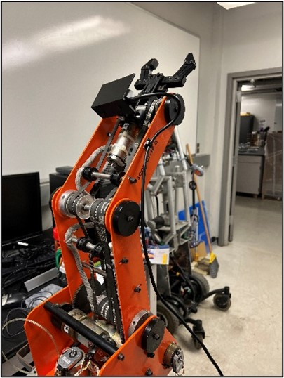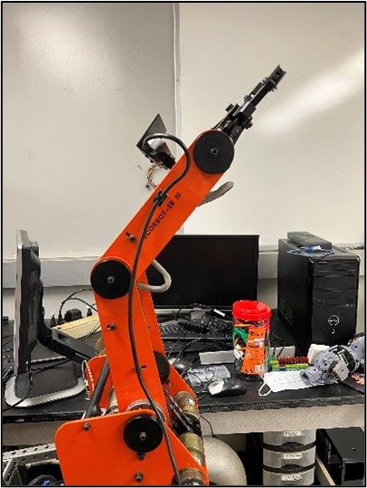
# Docker
 
To get the full ROS code we will create <strong>two images</strong>. We will apply <strong>multi-stage builds</strong>, which use multiple <em>FROM</em> statements in a Dockerfile. The first image contains the <strong>ROS melodic distribution</strong> and the second, the <strong>ROS simulation codes</strong>. Finally we will run the last image by creating a container named <strong>cali_project</strong>.


## 1) Build the 1st Image - ROS melodic Image

We build the 1st image named <strong>ros_melodic</strong> using the <strong>dockerfile_ros_melodic</strong> Dockerfile which uses the ROS Melodic distribution as a base.

```bash
cd ~/catkin_ws/src/docker_ros
sudo docker build -f dockerfile_ros_melodic -t ros_melodic .
```

## 2) Build the 2nd Image - Simulation codes

Now, we will build the second Image named <strong>cali_base</strong> using the <strong>dockerfile_cali</strong> Dockerfile which uses as base the 1st image <strong>ros_melodic</strong> and that will contain the ROS simulation codes.

```bash
sudo docker build -f dockerfile_cali -t cali_base .
```
## 3) Create the Container

<u><strong><em>Requirement</em></strong></u> : To run GUI applications in Docker on Linux hosts, you have to run <strong>"xhost +local:root"</strong>. To disallow, <strong>"xhost -local:root"</strong>. For Windows and Mac hosts please check : [Running GUI applications in Docker on Windows, Linux and Mac hosts](https://cuneyt.aliustaoglu.biz/en/running-gui-applications-in-docker-on-windows-linux-mac-hosts/). Can also found some more information about [Using GUI's with Docker](http://wiki.ros.org/docker/Tutorials/GUI).


```bash
xhost +local:root
```


We can now <strong>run</strong> the image by creating a container named <strong>cali_project</strong> using <strong>docker-compose</strong> :


  ```bash
 sudo docker-compose up
 ```


